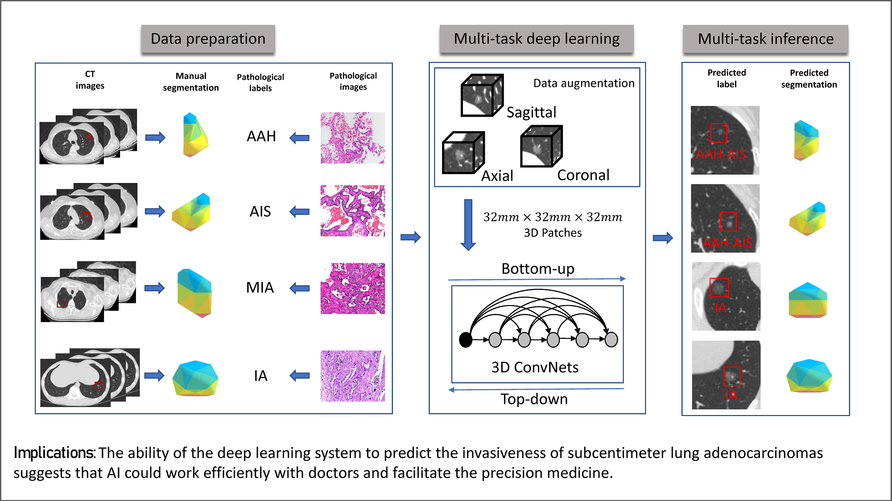
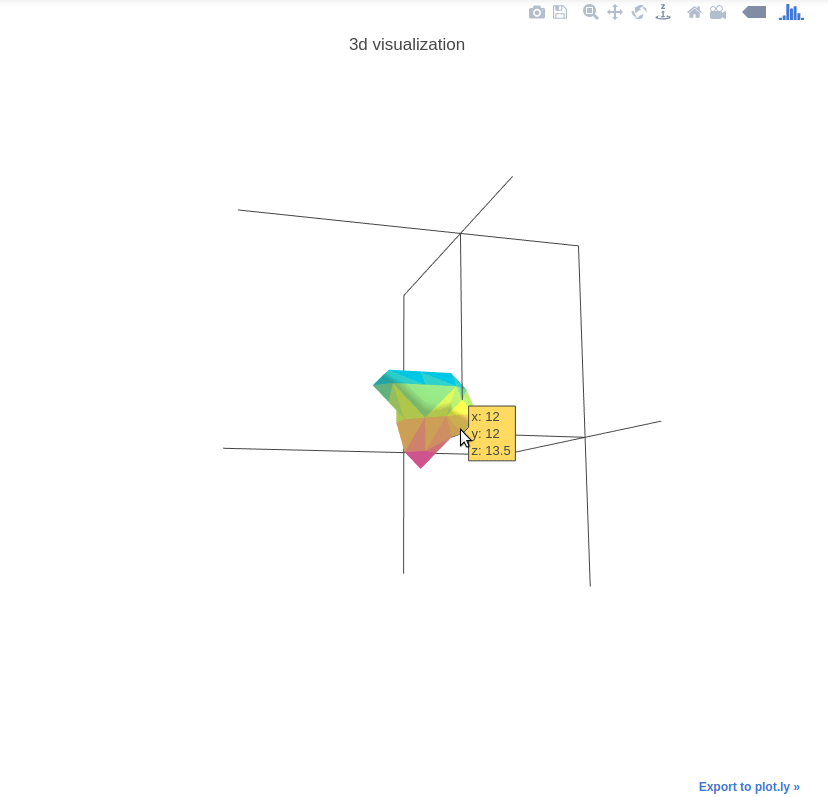

# DenseSharp Networks 
*DenseSharp* Networks are parameter-efficient 3D DenseNet-based deep neural networks, with multi-task
learning the nodule **classification** labels and **segmentation** masks. Segmentation (top-down path) 
learning elegantly guides classification (bottom-top path) to learn better. In this study, our networks learn to 
classify early-stage lung cancer from **CT** scans on **pathological** level. The deep learning models outperforms the 
radiologists (2 senior and 2 junior) in our observer study, which indicates the potentials to facilitate
precision medicine.

More details, please refer to our paper:

**3D Deep Learning from CT Scans Predicts Tumor Invasiveness of Subcentimeter Pulmonary Adenocarcinomas**

Wei Zhao†, Jiancheng Yang†, Yingli Sun, Cheng Li, Weilan Wu, Liang Jin, Zhiming Yang, Bingbing Ni, Pan Gao, Peijun Wang, Yanqing Hua and Ming Li (†indicates equal contribution)

*[Cancer Research](http://cancerres.aacrjournals.org/content/78/24/6881.full)* (DOI: 10.1158/0008-5472.CAN-18-0696)

# Code Structure
* [`mylib/`](mylib/):
    * [`dataloader/`](mylib/dataloader): PyTorch-like datasets and dataloaders for Keras.
    * [`models/`](mylib/models): 3D *DenseSharp* and *DenseNet* models together with the losses and metrics.
    * [`utils/`](mylib/utils): plot and multi-processing utils.
* [`explore.ipynb`](explore.ipynb): plots and basic views of networks.
* [`train.py`](train.py): the training script.

# Requirements
* Python 3 (Anaconda 3.6.3 specifically)
* TensorFlow==1.4.0
* Keras==2.1.5
* To plot the 3D mesh, you may also need [`plotly`](https://plot.ly/python/) installed. 

Higher versions should also work (perhaps with minor modifications).

# Data samples
Unfortunately, our dataset is not available publicly considering the patients' 
privacy, and restrictions apply to the use. 

However, you can still run the code using the sample dataset 
([download](https://drive.google.com/open?id=1c-suZobPIH-DSE99zspPb098jEiDqRGa)).
Please note, the sample dataset is just demonstrating the code functionality.
Unzip the sample dataset, then modify the `"DATASET"` in 
[`mylib/dataloader/ENVIRON`](mylib/dataloader/ENVIRON).

The *DenseSharp* Networks are generally designed for 3D data,
with classification and segmentation labels. You can run the code
on your own data if your dataset are processed following the sample data format.

Each sample (e.g., `demo1.npz`) is a nodule-centered patch with a size of 80mm x 80mm x 80mm, 
which is larger than the actual input size to ease the data augmentation implementation.
Each `npz` file contains a `voxel` (a 3D patch of pre-processed CT scan, as described in the paper)
and a `seg` (the corresponding manual segmentation masked by the radiologists). The `csv` file contains
the classification information. 

# 3D Nodule Mesh Plots
The 3D mesh plots are used for illustration interactively. See the following example:

The helper functions are provided in [`mylib/utils/plot3d.py`](mylib/utils/plot3d.py).

See [`explore.ipynb`](explore.ipynb) for the demo code. 
Control the mesh step by setting `step_size`.

# LICENSE
The code is under Apache-2.0 License.

The sample dataset is just for demonstration, neither commercial nor 
academic use is allowed.

